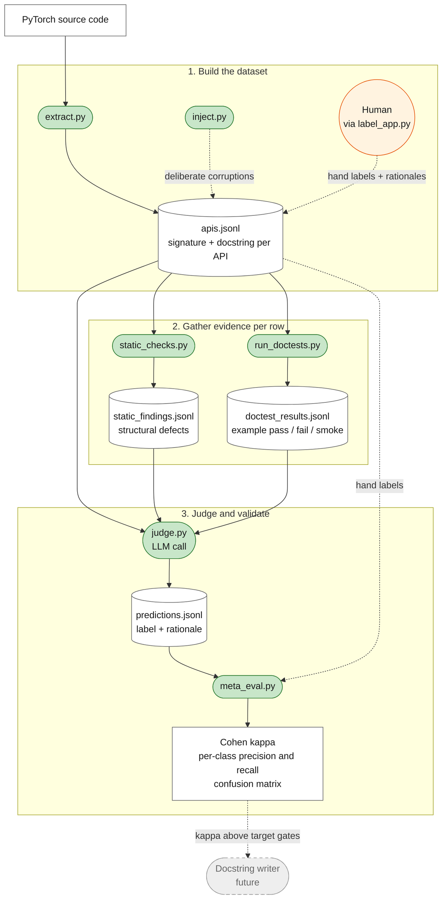

Every codebase with public APIs has a docs drift problem. New flags ship, defaults change, helpers move between modules, and the docstrings users read describe a version of the code that no longer exists. The cost of this used to be bounded by how often a human opened the page and how loudly they complained. That bound is gone. The reader is now often a model, and a model does not complain. It confidently quotes what it found and moves on.

The tempting move when you notice the drift is to point an LLM at the source and have it rewrite the stale parts. There are open-source tools that do roughly this. They produce plausible-looking output. You can run one today.

You should not.

An LLM-written docstring without a validated judge is a regression dressed as progress. The old failure mode was silent drift, a docstring that quietly fell out of sync with the code over a few releases. The new failure mode is confident hallucination at scale: output that reads more polished than the original but contains a default that is fictional, an argument that does not exist, or a behavioral claim that is the opposite of what the function does. That output then ships, gets indexed, gets summarized by other models, and propagates.

The thing you need before you ship the writer is a judge. Specifically a judge you have measured.

I'm going to use PyTorch as the case study because that's what I work on, but the architecture generalizes to any library with extractable, structured API documentation.

## What I'm building

[`docstring-judge`](https://github.com/svekars/docstring-judge) is the eval-first version of this. The hypothesis it tests: with a layered pipeline (deterministic structural checks where possible, an LLM only where prose-level reasoning is required, both grounded against a hand-labeled ground truth), can you get to a judge whose predictions you trust enough to gate an automated writer?

At the center of this is a small, hand-labeled golden dataset of PyTorch API rows. Building it is deliberately manual. The extractor walks a PyTorch module and emits one row per public function with its signature, parameters, and docstring as-shipped. Then a human (me) opens each row in a Streamlit UI and labels it `accurate`, `hallucinated`, `outdated`, `partial`, or `missing`, with a short rationale explaining the call. The injector adds a small set of deliberately corrupted rows so the dataset includes failure cases the natural corpus wouldn't supply, and those get labeled the same way.


The current labeled set is small on purpose: a starter slice of about a dozen rows across `torch.nn.functional`. The methodology has to hold end-to-end on a small set before scaling pays. Pushing to hundreds or thousands of rows is only worth doing once the judge agrees with the hand labels at the target kappa on the slice we have.

The labels and rationales are not throwaway. They define what each category means in practice, and that definition propagates everywhere: into the judge's prompt as the ground-truth taxonomy, into the meta-eval as the answer key the judge is scored against, and eventually into the writer's regression set. A docstring writer worth shipping has to produce output the validated judge classifies as `accurate`. If the labels are sloppy, every downstream component built on top is sloppy in the same shape.

The pipeline, with each script labeled by filename and each data artifact by the file it produces:



Reading top to bottom:

1. **Build the dataset.** `extract.py` walks the PyTorch source via AST and writes one row per public function. The human labels each row in the Streamlit UI. `inject.py` adds a small number of deliberate corruptions so the eval has known failures to catch.
2. **Gather evidence per row, in parallel.** `static_checks.py` does deterministic structural checks (default mismatches, fictional args, undocumented args, empty docstrings). `run_doctests.py` executes the `>>>` blocks via xdoctest to record whether each example actually runs.
3. **Judge and score.** `judge.py` calls Gemini with the docstring plus the two evidence streams and emits a label and rationale per row. `meta_eval.py` compares those predictions to the hand labels and prints Cohen's kappa, per-class precision and recall, and a confusion matrix. That report is what gates the future docstring writer.

Legend for the colors:

- Green nodes are scripts.
- White nodes are data files on disk.
- The orange node is the human labeler.
- The dashed gray node is the component that doesn't exist yet.

Two design choices matter.

**Deterministic checks come before the LLM, not after.** If a docstring says "Default: 0.1" and the signature says `p: float = 0.5`, no language model is required to know that is wrong. A regex and a parameter table catch it. Save the LLM for the cases that need reading comprehension: math contradictions in prose, inverted behavior descriptions, return types stated one way in the signature and another way in the prose. The static checker emits a structured list of findings. The judge consumes those findings as ground truth and only adds prose-level reasoning on top. That separation matters at scale: with 3K APIs you re-run the judge every time you tighten the prompt or change models, and pushing structural reasoning into deterministic code keeps each iteration cheap, fast, and reproducible.

**The judge is itself evaluated.** Not introspectively. Against a hand-labeled set that includes both real docs and deliberately corrupted ones, with kappa scoring and per-class precision and recall.

## A concrete case

`torch.nn.functional.dropout` is in the eval set as a deliberately corrupted row. Real PyTorch docs are mostly accurate, so the dataset includes a small number of synthetic errors. Otherwise the judge has nothing to fail on and every judgment looks fine. The corruption injector is a tool that swaps a substring in a docstring while stashing the upstream original so the change can be reverted. For dropout, it changed `Default: 0.5` to `Default: 0.1` in the docstring's Args section. The signature is untouched, so `p: float = 0.5` is still in the code.

Three components run independently:

- **The doctest runner** executes the `>>>` example blocks already in the docstring using `xdoctest`, the same framework PyTorch's own CI uses to validate examples. The dropout example smoke-passes: the function is callable, the example doesn't crash, so by execution alone there is nothing to flag. This is exactly the kind of error a "did the example run?" CI check misses, because nothing about running the example checks whether the prose around it is true.
- **The static checker** emits a `default_mismatch` finding with documented `0.1` and actual `0.5`. Deterministic, sourced from the parsed Args section against the signature. No LLM involved.
- **The LLM judge** receives the docstring, the static findings, and the execution evidence. Classifies as `hallucinated` with the correct rationale.

That last step is consistent only because the static checker already did the structural work. The judge's job was to weigh the finding's severity, not to re-derive it. Asked to reason about defaults without the structural finding, an LLM will sometimes find the inconsistency and sometimes miss it depending on prompt and run. Handed a finding, it is reliable and explainable.

## Methodology

A few terms show up in the eval output that deserve a sentence each.

**The five labels.** Every row gets one of these, both from the human and from the judge.

- `accurate`: docstring matches the signature and observable behavior.
- `hallucinated`: a serious wrong claim, like a fabricated default, a fictional argument, contradictory math in the prose, or an inverted behavior description.
- `outdated`: an argument name documented but absent from the signature, suggesting the API was renamed and the docs lag.
- `partial`: one isolated defect in an otherwise correct doc.
- `missing`: no docstring at all.

Hallucinated and outdated are kept distinct because they call for different fixes (rewrite versus revert and update).

**Cohen's kappa.** Cohen's kappa (κ) is a statistical metric for inter-rater reliability on categorical data. It measures how consistently two raters, here the human labeler and the LLM judge, assign the same category to the same item, while correcting for the agreement you would expect from random chance. We use it instead of simple agreement (the raw fraction of rows where the judge and human pick the same label) because simple agreement overstates performance when one class dominates: if 90% of rows are `accurate`, a judge that says `accurate` for everything scores 90% without thinking. Kappa subtracts the chance-expected agreement out: `(observed - expected) / (1 - expected)`. Kappa = 1 is perfect, 0 is chance-level, negative is worse than chance. Rough conventions: > 0.6 is substantial agreement, > 0.8 is near-perfect, < 0.4 is questionable. The target for this project is κ > 0.6 before the judge is trusted on unseen rows.

**Per-class precision and recall.** Each label is treated as a one-vs-rest binary task. Precision for `hallucinated` is: of the rows the judge called hallucinated, how many actually were. Recall for `hallucinated` is: of the rows that actually are hallucinated, how many the judge caught. F1 is the harmonic mean. The per-class view matters because overall agreement can hide a class the judge handles badly.

**Confusion matrix.** A small table where rows are the hand label and columns are the judge's label. The diagonal is agreement. The off-diagonal shows the structure of the disagreements: whether the judge tends to escalate severity, under-flag defects, or swap specific categories.

**Corrupted vs natural breakdown.** The corrupted rows are the oracle test, the judge should catch them. The natural rows are the real-world test: does the judge agree with a careful human on production docs? Pooling them gives a number biased toward whichever group is bigger. Splitting them is what makes the agreement number informative.

## The trial: 14 APIs end-to-end

To make this concrete, here's what one full pipeline run looks like on a starter slice of `torch.nn.functional`. The dataset is 14 rows: 2 deliberately corrupted, 12 untouched upstream docstrings.

```sh
source .venv/bin/activate
export GEMINI_API_KEY=...   # judge.py defaults to Gemini, but any LLM would work

# 1. Inject a corruption so the eval has something to fail on
python inject.py swap torch.nn.functional.dropout \
    --find "Default: 0.5" --replace "Default: 0.1" \
    --note "Changed p default in Args section from 0.5 to 0.1"

# 2. Hand-label every row in the Streamlit UI
streamlit run label_app.py

# 3. Deterministic structural checks
python static_checks.py

# 4. Execute the >>> blocks in each docstring via xdoctest
python run_doctests.py --cpu-only

# 5. Run the LLM judge
python judge.py --skip-existing
```

The judge prints one classification per row as it goes:

```
Detecting available models... using gemini-2.5-flash
Judging 14 record(s) with gemini-2.5-flash...
[1/14]  torch.nn.functional.dropout         hallucinated
[2/14]  torch.nn.functional.relu            accurate
[3/14]  torch.nn.functional.softmax         accurate
[4/14]  torch.nn.functional.log_softmax     accurate
[5/14]  torch.nn.functional.embedding       accurate
[6/14]  torch.nn.functional.batch_norm      accurate
[7/14]  torch.nn.functional.layer_norm      accurate
[8/14]  torch.nn.functional.nll_loss        accurate
[9/14]  torch.nn.functional.cross_entropy   hallucinated
[10/14] torch.nn.functional.mse_loss        accurate
[11/14] torch.nn.functional.interpolate     accurate
[12/14] torch.nn.functional.grid_sample     partial
[13/14] torch.nn.functional.pad             partial
[14/14] torch.nn.functional.normalize       accurate

Wrote 14 prediction(s) to data/predictions.jsonl
Predictions by label: accurate 10, hallucinated 2, partial 2
```

Both corrupted rows come back as `hallucinated`. Two natural rows come back as `partial`. The rest as `accurate`. That looks plausible. The meta-eval scores it against the hand labels:

```sh
python meta_eval.py
```

```
Overall: n=14, agreement=92.9%, Cohen's kappa=0.854
  (n < 20: kappa is noisy; expand the eval set before trusting it)

Per-class metrics:
  class          precision   recall      f1       support
  accurate       0.900       1.000       0.947    9
  hallucinated   1.000       1.000       1.000    2
  partial        1.000       0.667       0.800    3

Confusion matrix (rows = hand label, cols = prediction):
              accurate  hallucinated  partial
accurate      9         0             0
hallucinated  0         2             0
partial       1         0             2

[corrupted rows (oracle test)] n=2, agreement=100.0%
[natural rows (real PyTorch docs)] n=12, agreement=91.7%, kappa=0.750
```

13 of 14 match. Cohen's kappa is 0.854 overall, 0.750 on natural rows alone. Both corruptions are caught perfectly. One disagreement, on `torch.nn.functional.interpolate`:

**Hand label** — `partial`. The docstring is accurate and highly detailed regarding modes and alignment behavior. However, it contains an unrendered Sphinx placeholder `{backward_reproducibility_note}` and lacks code examples.

**Judge label** — `accurate`. The docstring accurately describes the requirement that either `size` or `scale_factor` must be defined.

The judge missed the unrendered Sphinx placeholder. That kind of prose-level defect, a templating bug visible only when you read the rendered output, is exactly the case the LLM is supposed to catch and the static checker by design cannot. The fix lives in the judge prompt: add an instruction to flag unsubstituted template markers like `{name}` in prose as a defect.

The headline number, kappa=0.854 with 100% agreement on the corruption oracle, clears the kappa>0.6 target by a wide margin. But the eval set is too small to trust that number. At n=14, removing or re-labeling a single row swings kappa by 0.05-0.10. The right read is: the methodology is working on this slice, and the judge is close to ready, but the slice has to grow before any of these numbers are load-bearing.

## What's next

Three things, in order:

1. **Grow the labeled set.** The dataset has to get bigger before the kappa number means anything. The realistic target is ~50 rows across at least three modules (`torch.nn.functional`, `torch.optim`, `torch`), with each label class having 5-10 examples. That makes the per-class precision and recall stable and the corrupted-vs-natural breakdown actually informative.
2. **Patch the judge prompt for the interpolate miss.** Add an explicit rule: unrendered Sphinx placeholders, `{name}`-style template markers left in the prose, count as a defect. Re-run the judge against the same slice and confirm the disagreement closes. Then expand to more rows and re-measure.
3. **Wire the kappa gate into CI.** Once the dataset is bigger and the prompt is tighter, the meta-eval should run on every change to the judge prompt or model. A kappa drop below 0.7 against the hand labels blocks the change. That makes the eval set load-bearing infrastructure, not a notebook artifact.

Only after these does the generator come online. The generator's regression test is the validated judge, and a judge with a flaky kappa or a known prompt bug is not a regression test, it's vibes.

## The tools

Seven scripts. They map cleanly to roles.

- **`extract.py`** parses a PyTorch module via AST and emits one JSON object per public function: signature, parameters, docstring, source pointer, commit hash of the checkout. Re-running it preserves hand labels.
- **`inject.py`** is the corruption tool. `swap` finds a substring in a docstring and replaces it, stashing the original. `revert` undoes one. The eval set needs synthetic errors because real PyTorch docs are mostly accurate; a judge with nothing to fail on is uninformative.
- **`label_app.py`** is a Streamlit UI that walks the dataset one row at a time. Writes back to the JSONL atomically. Corrupted rows are flagged and the original docstring is one click away.
- **`static_checks.py`** runs the deterministic pass. Parses the Args section, compares against the signature, flags `default_mismatch`, `fictional_arg`, `undocumented_arg`, and `empty_docstring`. No LLM, no API key.
- **`run_doctests.py`** executes the code blocks in each docstring against the installed PyTorch and records pass, fail, smoke-passed, or skipped. The judge uses this only as evidence of callability, not as proof of prose correctness.
- **`judge.py`** is the LLM judge. Receives the docstring, structural findings, and execution evidence. Classifies into one of five labels and produces a rationale. Critically, it is instructed to trust the structural checker and not to invent structural concerns.
- **`meta_eval.py`** compares the judge's predictions to the hand labels. Reports simple agreement, Cohen's kappa, per-class precision and recall and F1, a confusion matrix, and a corrupted-vs-natural subset breakdown so synthetic and real are not pooled.

## What this generalizes to

The lesson is bigger than docstrings. Anywhere an LLM writes the canonical version of something, you need a validated judge before you ship the writer. The judge has to be measured against ground truth on the same kinds of mistakes the writer is going to make. The measurement has to be transparent enough that you can argue with it.

Without that, what you have shipped is a confident lie generator. The lies happen less often than a hand-maintained page would drift, which feels like progress. But each lie is delivered with no hedging, attached to a brand name people trust, propagated to other models that read it. The cost of one wrong page is not what it used to be.

The judge comes first. Then the writer.
