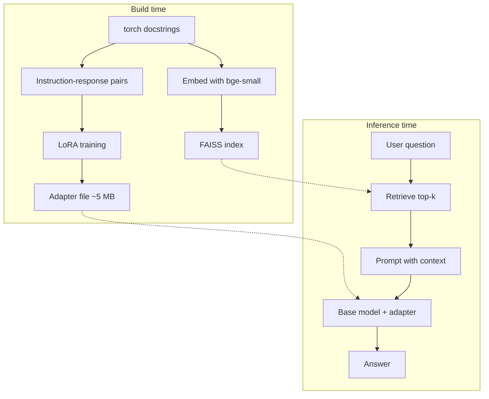
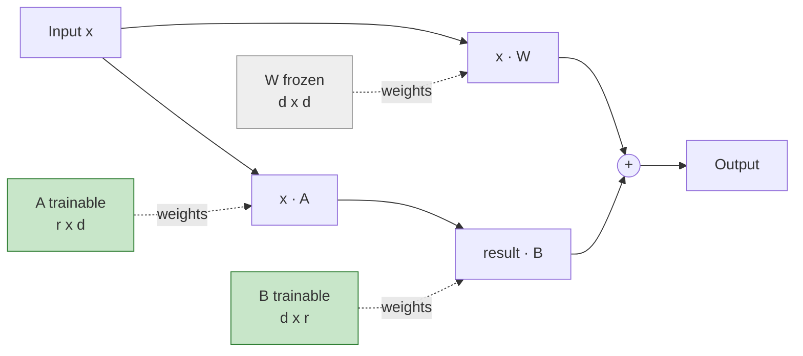
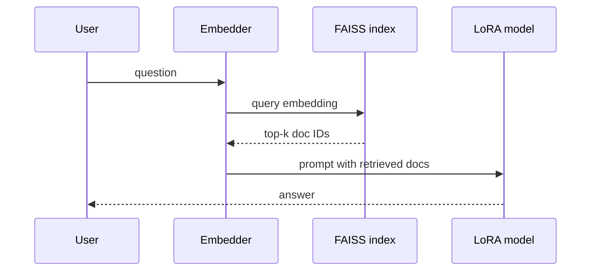

<p><a href="https://colab.research.google.com/drive/1F-lP8-BinkTkH2GKxVxMmtwlJoiEm6yV?usp=sharing" target="_blank" rel="noopener"></a></p>

This is a runnable walkthrough that builds a small question-answering assistant for the PyTorch API. The pipeline has two parts:

- **LoRA fine-tuning** teaches a small base model (Qwen 2.5-0.5B) the *style* of answer we want: short, direct, code-first replies to PyTorch questions.
- **Retrieval-Augmented Generation (RAG)** supplies the model with the actual docstrings at inference time, so it grounds answers in real signatures instead of hallucinating them.

The full pipeline fits on a free Colab T4 in about 10 to 15 minutes.



## Background: Why LoRA?

Full fine-tuning of even a small model is expensive. For Qwen 2.5-0.5B (about 500 million parameters), you would need gradients and optimizer states for every weight, totalling several GB of GPU memory.

LoRA (Low-Rank Adaptation) sidesteps this. Instead of updating each weight matrix `W` directly, it freezes `W` and learns a small low-rank update: `W' = W + BA`, where `A` is a small `(r, d)` matrix and `B` is `(d, r)`, with `r` much smaller than `d` (typically 4 to 64). The trainable parameter count drops from `d²` to `2dr`. For `d=1024, r=8`, that is a 64x reduction per matrix.



The base model weights stay frozen, so the model retains everything it learned during pretraining. We only train `A` and `B` for selected projection layers, usually the attention block's `q_proj`, `k_proj`, `v_proj`, and `o_proj`. The output of training is a tiny adapter file. To use the fine-tuned model later, you load the original base model and apply the adapter on top.

## Background: Why also RAG?

LoRA can teach the model *how* to answer, but it is a bad way to teach *facts*. A 0.5B model fine-tuned on PyTorch docstrings will still hallucinate argument names: the dataset is too small, the model's memorization capacity is limited, and LoRA's whole point is to make minimal weight changes.

RAG solves this by giving the model the relevant docs *at the time it answers*. The model no longer needs to *know* the API. It needs to know how to *use* retrieved context. That is exactly what LoRA is good at teaching.



If you skip LoRA, the base 0.5B model rambles or ignores the format. If you skip RAG, LoRA alone confidently invents argument names. Together they cover each other's weakness.

## Build the training dataset

The cleanest source of PyTorch documentation is the `torch` module itself. Every public function and class carries a docstring with a description, signature, and often a worked example. We extract them with `inspect`.

```python
import inspect, torch

def collect_api_docs(module, prefix):
    items = []
    for name in dir(module):
        if name.startswith("_"):
            continue
        obj = getattr(module, name)
        if not callable(obj):
            continue
        doc = inspect.getdoc(obj)
        if not doc or len(doc) < 50:
            continue
        try:
            sig = str(inspect.signature(obj))
        except (ValueError, TypeError):
            sig = "(...)"
        items.append({"api": f"{prefix}.{name}", "signature": sig, "doc": doc})
    return items

apis = []
apis += collect_api_docs(torch, prefix="torch")
apis += collect_api_docs(torch.nn, prefix="torch.nn")
apis += collect_api_docs(torch.nn.functional, prefix="torch.nn.functional")
```

For each API we generate two training examples, one asking about the signature and one about behavior. This is a deliberate format we are teaching the model.

```python
def make_pairs(api_entry):
    api, sig = api_entry["api"], api_entry["signature"]
    summary = api_entry["doc"].split("\n\n")[0].strip()
    return [
        {"instruction": f"What is the signature of {api}?", "response": f"{api}{sig}"},
        {"instruction": f"What does {api} do?", "response": summary},
    ]

pairs = [p for entry in apis for p in make_pairs(entry)]
```

## Configure LoRA

```python
from peft import LoraConfig, get_peft_model, TaskType

lora_config = LoraConfig(
    task_type=TaskType.CAUSAL_LM,
    r=16,
    lora_alpha=32,
    lora_dropout=0.05,
    target_modules=["q_proj", "k_proj", "v_proj", "o_proj"],
)
model = get_peft_model(model, lora_config)
model.print_trainable_parameters()
# trainable params: ~1M || all params: ~500M || trainable%: 0.21%
```

Each knob does something specific:

- `r=16` is the rank of the low-rank decomposition.
- `lora_alpha=32` scales the adapter's contribution by `lora_alpha / r`.
- `lora_dropout=0.05` regularizes for small datasets.
- `target_modules` chooses which weight matrices get adapters. Targeting all four attention projections is the usual sweet spot.

## Train

Format each example as `### Instruction: ...\n### Response: ...<eos>` and let the standard HuggingFace `Trainer` do its thing.

```python
trainer = Trainer(
    model=model,
    args=TrainingArguments(
        output_dir="qwen-pytorch-lora",
        per_device_train_batch_size=8,
        gradient_accumulation_steps=2,
        num_train_epochs=1,
        learning_rate=2e-4,
        fp16=True,
        logging_steps=20,
        save_strategy="no",
        report_to="none",
    ),
    train_dataset=ds,
    data_collator=DataCollatorForLanguageModeling(tok, mlm=False),
)
trainer.train()
model.save_pretrained("qwen-pytorch-lora/adapter")
```

About 3 to 5 minutes on T4. The adapter file is a few MB.

## Build the RAG index

Embed every doc once and store the vectors in a FAISS index. `bge-small-en-v1.5` is a fast 33 MB embedding model that performs well on technical text.

```python
from sentence_transformers import SentenceTransformer
import faiss, numpy as np

embedder = SentenceTransformer("BAAI/bge-small-en-v1.5")
texts = [f"{a['api']}{a['signature']}\n{a['doc']}" for a in apis]
embeddings = embedder.encode(texts, normalize_embeddings=True, batch_size=64)
embeddings = np.asarray(embeddings, dtype="float32")

index = faiss.IndexFlatIP(embeddings.shape[1])
index.add(embeddings)
```

## Inference: LoRA plus RAG

```python
def retrieve(query, k=3):
    q = embedder.encode([query], normalize_embeddings=True)
    scores, ids = index.search(np.asarray(q, dtype="float32"), k)
    return [apis[i] for i in ids[0]]

def answer(question):
    docs = retrieve(question, k=3)
    context = "\n\n".join(f"{d['api']}{d['signature']}\n{d['doc'][:300]}" for d in docs)
    prompt = (
        "Use the following PyTorch docs to answer. "
        "Be concise: one short code snippet and one sentence of explanation.\n\n"
        f"DOCS:\n{context}\n\n"
        f"### Instruction: {question}\n### Response:"
    )
    inputs = tok(prompt, return_tensors="pt").to("cuda")
    out = model.generate(**inputs, max_new_tokens=150, do_sample=False, pad_token_id=tok.eos_token_id)
    return tok.decode(out[0][inputs["input_ids"].shape[1]:], skip_special_tokens=True).strip()
```

To see what RAG buys, run the same questions without context. The notebook includes an ablation cell that prints both side by side.

## What we got

Running the four sample questions through both paths gives an honest picture of what this size of model and dataset can do.

The retrieval sanity check shows where the embedder is strong and where it isn't. It does well on lexical queries like "softmax" but misses the conceptual "move tensor to GPU" because `Tensor.to` is a method, not a top-level `torch.*` function, and the dataset builder only walks module-level callables.

```
Query: compute softmax along a dimension
  0.743  torch.nn.Softmax2d
  0.722  torch.nn.Softmax
  0.696  torch.nn.AdaptiveLogSoftmaxWithLoss

Query: move tensor to GPU
  0.719  torch.nn.functional.pixel_shuffle
  0.718  torch.randperm
  0.717  torch.from_dlpack

Query: save model weights to disk
  0.677  torch.load
  0.671  torch.nn.NLLLoss
  0.666  torch.nn.MultiMarginLoss
```

End-to-end answers, comparing LoRA-plus-RAG against the same LoRA-tuned model without any retrieved context:

**Q: How do I move a tensor to GPU?**

LoRA plus RAG (retrieval hit `movedim`, not `Tensor.to`):

```
movedim(input, source, destination) -> Tensor
Moves the dimension(s) of :attr:`input` at the position(s) in :attr:`source`
to the position(s) in :attr:`destination`.
```

LoRA only:

```
To move a tensor to GPU, you can use the `to` method.
tensor.to(device='cuda')
```

**Q: What does torch.no_grad do?**

LoRA plus RAG: `None` (model gave up).

LoRA only:

```
no_grad() -> NoneType
Do not perform gradient computation. This is equivalent to calling torch.no_grad().
```

**Q: How do I save model weights to disk?**

LoRA plus RAG (overconfident, invented dict schema):

```
torch.save(model, filename) -> None
Save the model to disk. ... state_dict, optimizer_state_dict, trainable_parameters,
non_trainable_parameters, epoch, batch_size, device, model_name, model_type ...
```

LoRA only:

```
torch.save(model, filename)
```

The takeaways are useful and a little uncomfortable:

- Retrieval needs to be domain-tuned for technical jargon. The corpus is also missing `Tensor` methods, which is a one-line fix to the dataset builder.
- A 0.5B model trained on 1600 templated pairs over-applies the template, producing long fabricated docstrings even when the right answer is one line.
- When retrieval misses, the model trusts the wrong context. Bad context is worse than no context. A real system needs a confidence threshold that drops retrieval results below some score.

So the recipe is sound but the components are deliberately small. The same code with a 7B model, a richer paraphrased dataset, and a reranker is the obvious follow-up.

## Next steps

A few directions to take this further once the basic pipeline works.

- **Better dataset.** Have a larger model paraphrase the questions so the model sees a variety of phrasings, not just the two templates per API. Add multi-turn examples or harder composition questions. Include `Tensor` methods.
- **Larger base model.** Qwen 2.5-1.5B fits on a T4 in fp16. The 7B variant needs an A100 or L4, or 4-bit quantization with `bitsandbytes` (QLoRA). The adapter trains the same way; only the base model loading changes.
- **Better retrieval.** Chunk long docstrings into smaller passages, add a reranker like `bge-reranker-base`, or extend the corpus with PyTorch tutorial pages. Add a confidence threshold so weak retrievals get dropped instead of fed to the model.
- **Evaluation.** Hand-curate 50 question and answer pairs as a held-out set. Measure exact-match on API names and signatures. Compare with and without LoRA, with and without RAG, to confirm each piece is pulling its weight.
- **Serving.** Merge the adapter into the base model with `model.merge_and_unload()` for a single deployable checkpoint, or keep them separate and use `peft` at load time if you want to swap adapters per use case.

The full notebook with mounted-Drive setup, ablations, and resume-later cells [opens in Colab](https://colab.research.google.com/drive/1F-lP8-BinkTkH2GKxVxMmtwlJoiEm6yV?usp=sharing).
